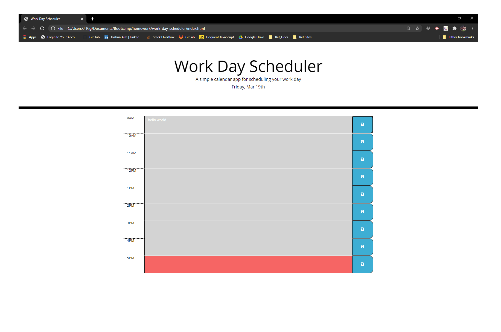

# work_day_scheduler
Work Day Scheduler Bootcamp Week 3


## Acceptance Criteria

```md
GIVEN I am using a daily planner to create a schedule
WHEN I open the planner
THEN the current day is displayed at the top of the calendar - completed
WHEN I scroll down
THEN I am presented with timeblocks for standard business hours - completed 9AM to 5PM
WHEN I view the timeblocks for that day
THEN each timeblock is color coded to indicate whether it is in the past, present, or future - still working on getting this to work
WHEN I click into a timeblock
THEN I can enter an event - text entry is working
WHEN I click the save button for that timeblock - still working on this. 
THEN the text for that event is saved in local storage - still working on this
WHEN I refresh the page
THEN the saved events persist - still working on this.  
```

## Link
* <https://jmalm79.github.io/work_day_scheduler/>   


